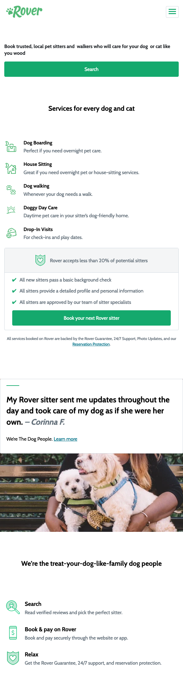
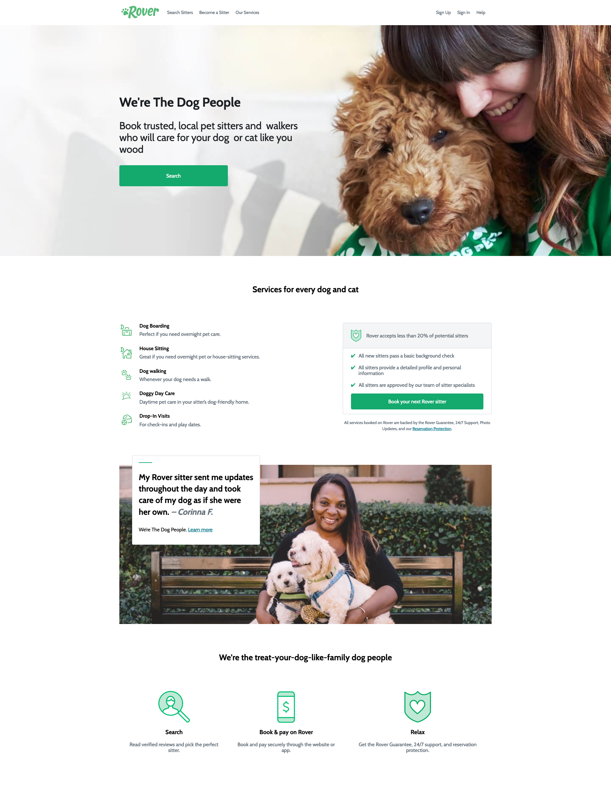

# Responsive Lab

### Desktop

### Breakpoints

- Mobile: =< 600px

### Max width

`1170px`

## Content

Thanks for checking out this this Rover Pet Sitters project.

This was completed as part of a class project in a short course I did with [General Assembly](https://generalassemb.ly/students/courses/front-end-web-development-short-course/london).

This project was focused on working on your JavaScript skills as well as working on responsive design.
